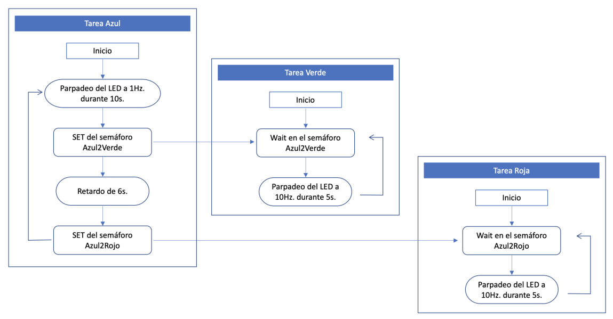
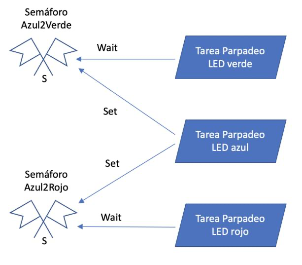
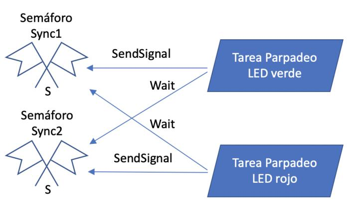
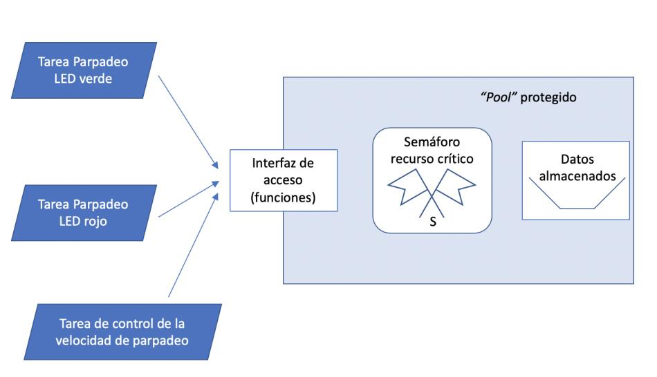

# Pr4_II: Comunicacion entre tareas

**Objetivos**

- comunicaciones unilaterales y bilaterales con semáforos
- usar “pools” para el intercambio de datos sin sincronización.

## Ejercicio 1: Sincro unilateral

Como en el ejercicio de la práctica anterior, se pretende establecer una sincronización unilateral.

a) Implemente el sistema descrito creando dos semáforos (Azul2Verde, Azul2Rojo) para la sincronización. En este caso, las instrucciones Set y Wait explicadas en las clases, serán  sustituidas por las operaciones Wait y Release de los semáforos.

b) Utilice las instrucciones ya conocidas para actuar sobre los semáforos, inicialice los semáforos bloqueados para poder implementar la sincronización deseada. ¿Podría utilizarse un mutex?

## Ejercicio 2: Sincro. bilateral

En este segundo ejercicio se propone el uso de semáforos para conseguir una sincronización bilateral:

En este caso, las instrucciones SendSignal y Wait explicadas en las clases, serán  sustituidas por las operaciones Wait y Release de los semáforos.

## Ejercicio 3: Libreria pool.h

**Crear un archivo pool.c**

- La definición de la estructura de datos (pool.h)
- La creación del semáforo (handle y semáforo) y  funciones de acceso que sean necesarias

**Tarea de control de la velocidad**

- Cambio de la consigna de frecuencia de parpadeo del LED verde a 1Hz 
  Cambio de la consigna de frecuencia de parpadeo del LED rojo a 10Hz 
  Delay de 8 s.
- Cambio de la consigna de frecuencia de parpadeo del LED verde a 10Hz 
  Cambio de la consigna de frecuencia de parpadeo del LED rojo a 1Hz 
  Delay. Volver al principio

**Tarea del LED verde (10s)**

- Comprobar la frecuencia del pool. Mostrar por consola y ajustar parpadeo del LED

**Tarea del LED rojo (6s)**

- Comprobar y ajustar la frecuencia de parpadeo del LED (idem)