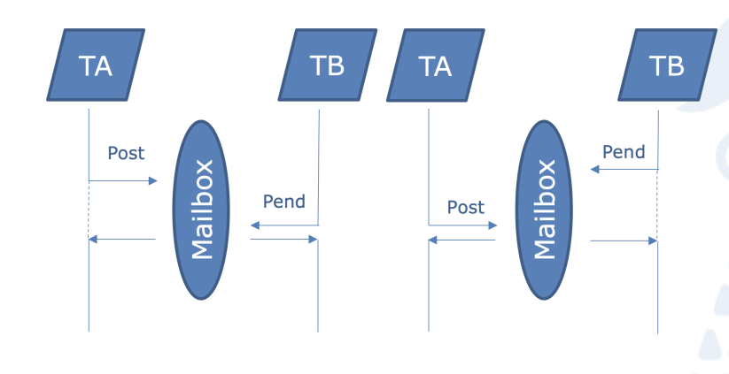

# Mailbox

## Minimos 70%

Plantee un problema que requiera el uso de un “mailbox” para sincronizar el intercambio de
datos entre, al menos, dos tareas 

El “mailbox” debe incluir como mínimo (en el caso de dos tareas):

- Un elemento para el intercambio de datos.
- Un mutex como mecanismo de exclusión mutua en el acceso a este elemento.
- Dos semáforos para implementar la sincronización entre las tareas.

## Opcional 30%

Investigue y utilice en su diseño algún elemento de la placa no estudiado en el desarrollo de la
asignatura (interfaces de comunicación, ADCs, GPIOs, etc.).

Encapsule completamente el código que implementa los “mailbox”, de manera que las tareas
solo puedan acceder a las funciones “post” y “pend” creadas para la utilización del mailbox”.

## Adquisición y Monitoreo de Temperatura

Simularemos un sistema incrustado donde una tarea de alta prioridad adquiere datos de un sensor de temperatura, y una tarea de baja prioridad lee y muestra periódicamente la temperatura en una consola o pantalla.

- **T_Adquisicion**. Lee periódicamente el sensor de temperatura y envía el dato al Mailbox.**Prior. Alta**
- **T_Monitoreo**. Espera a recibir un dato en el Mailbox, lo lee y lo muestra en la consola. **Prior. Baja**

El Mailbox debe cumplir con la estructura requerida:

1. **Elemento de Datos:** Una variable `int` para almacenar el valor de la temperatura en décimas de grado Celsius.
2. Un **Mutex** (`Mailbox_Mutex`) para asegurar que solo una tarea (Adquisición o Monitoreo) acceda a la variable de temperatura a la vez.
3. **Sincronización:**
   - **Semáforo 1 (`DataAvailable_Sem`)**: Usado por `T_Adquisicion` para indicar que hay un dato nuevo listo.
   - **Semáforo 2 (`BufferEmpty_Sem`)**: Usado por `T_Monitoreo` para indicar que el dato anterior ha sido leído y el buffer está listo para recibir el siguiente.

------

La solución se encapsularía en un archivo `mailbox.h` y `mailbox.c`, proporcionando las funciones de acceso:

`// Estructura interna del Mailbox`
`typedef struct {`
    `int temperature_data;`
    `osMutexId Mailbox_Mutex;`
    `osSemaphoreId DataAvailable_Sem;`
    `osSemaphoreId BufferEmpty_Sem;`
`} Mailbox_t;`

`void Mailbox_Init(void);`
`int Mailbox_Pend(void); // Tarea receptora (Monitoreo)`
`void Mailbox_Post(int new_temp); // Tarea remitente (Adquisicion)`

#### `T_Adquisicion` llama a `Mailbox_Post`

1. **Espera Buffer Vacío:** Hace `osSemaphoreWait(BufferEmpty_Sem, osWaitForever)`. Esto suspende a la tarea hasta que `T_Monitoreo` lea el dato anterior y libere el semáforo.
2. **Adquiere Mutex:** Hace `osMutexWait(Mailbox_Mutex, osWaitForever)` para obtener acceso exclusivo a la variable de datos.
3. **Escribe Datos:** `mailbox.temperature_data = new_temp;`
4. **Libera Mutex:** Hace `osMutexRelease(Mailbox_Mutex)`.
5. **Señala Datos Listos:** Hace `osSemaphoreRelease(DataAvailable_Sem)`.

#### `T_Monitoreo` llama a `Mailbox_Pend`

1. **Espera Datos Listos:** Hace `osSemaphoreWait(DataAvailable_Sem, osWaitForever)`. Esto suspende a la tarea hasta que `T_Adquisicion` coloque y señale un dato.
2. **Adquiere Mutex:** Hace `osMutexWait(Mailbox_Mutex, osWaitForever)` para obtener acceso exclusivo a la variable de datos.
3. **Lee Datos:** `read_temp = mailbox.temperature_data;`
4. **Libera Mutex:** Hace `osMutexRelease(Mailbox_Mutex)`.
5. **Señala Buffer Vacío:** Hace `osSemaphoreRelease(BufferEmpty_Sem)`.

Diagrama de flujo de datos y sincronización de un Mailbox con un Mutex para exclusión mutua y dos Semáforos para sincronización productor-consumidor (DataAvailable y BufferEmpty)

Este esquema asegura que la comunicación es **segura** (por el Mutex) y **sincronizada** (la Tarea Adquisición espera a que la Tarea Monitoreo termine, y viceversa, gracias a los dos semáforos).