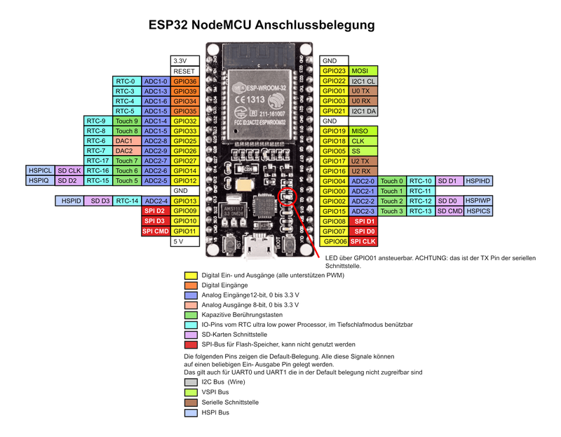

# ESP32

The ESP32 offers a range of GPIOs, allowing digital signals to be read or output. These pins are crucial for interfacing with sensors, actuators, and other digital devices.

The ESP32 has 34 GPIO pins in total numbered GPIO0 to GPIO39. Some GPIO pins are not accessible to users because they serve a special function. Examples of these are GPIO20 and GPIO28 to GPIO31. Moreover, GPIO37 and GPIO38 are not accessible on the development board.

### Inputs

Take note that, GPIOs 34, 35, 36, and 39 are input-only pins.

### UART

The transmit and receive pins for UART0 are GPI01 and GPIO3 respectively (LED1 is connected to GPIO1).

### I2C

The default hardware I2C pins for the ESP32 are GPIO22 (SCL) and GPIO21 (SDA). If using software I2C, any digital I/O pin can be used. You just need to specify which pin during the initialization of the Wire object.

### Configuration

**Strapping pins** play a vital role during the device's boot process. They help set various configuration options, such as boot mode and flash voltage. Proper utilization of strapping pins is crucial for configuring the ESP32 at startup.

The pins GPIO12, GPIO0, GPIO2, GPIO4, GPIO15 and GPIO5 are all strapping pins. Being such, users cannot make them HIGH or LOW normally through code. If you are using a development board, there is no need to worry about these pins as they have been automatically controlled via the USB-TTL chip.

The enable pin is the one labeled EN on the ESP32 development board. Remember that when EN is pulled LOW, the ESP32 is disabled. When the EN pin is high or left as is, the ESP32 is enabled.

## References

- [Code V10.x.x](www.freertos.org/documentation/code)
- [Master de la UCM](https://miot-rpi.github.io/practicas/)
- [AZ delivery](https://www.az-delivery.de/en/products/esp32-developmentboard)